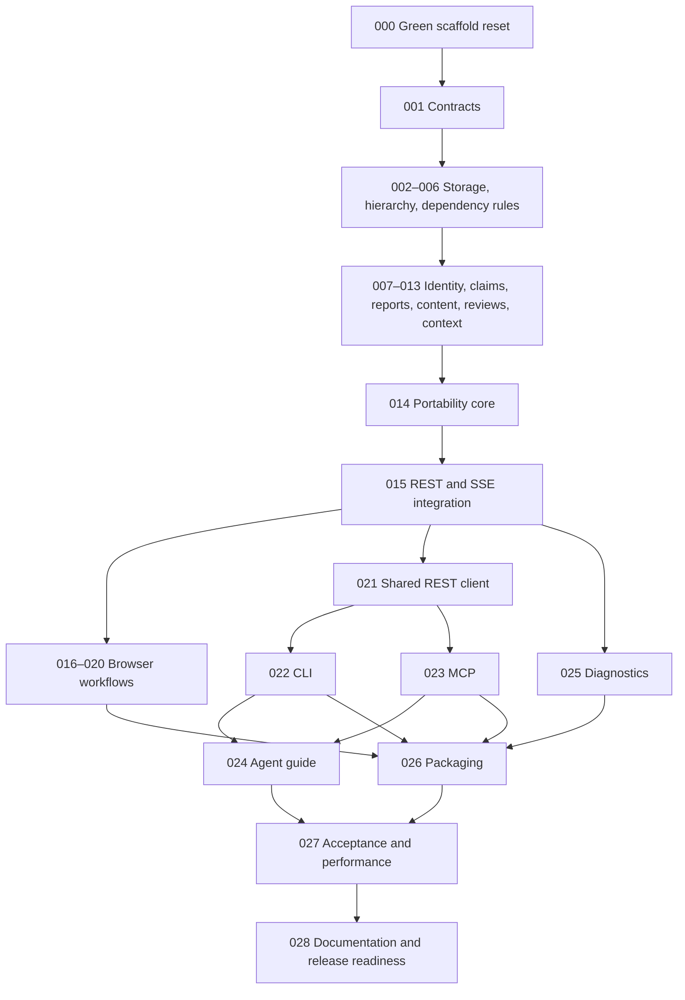

# Shepherd stable v1 — implementation handbook

**This folder is the complete target specification, not implemented application behavior.** The deliverable in this change is documentation. The existing repository remains the MVP. All implementation steps start not started; step 000 first removes the MVP product implementation while retaining a green engineering scaffold, then the application is built in the sequence below.

Shepherd is a local coordination hub for one human and multiple external agents. Hierarchy: **Project → Goal → Epic → Task**. Goals are independent outcomes. Epics and tasks have separate lifecycle and dependency rules; tasks can plan early, persist reviewed revisions, and hand execution to another agent. Browser UI, REST, CLI, MCP and an agent guide ship together. No agent spawning, hosted teams, Jira scheduling suite, recursive decomposition or MVP data converter.

## Start an implementation session

> Read plan/README.md and plan/steps/README.md. Implement the first incomplete step whose prerequisites are complete. Read its linked specifications, make only its changes, run its checks, and fill its handoff record. Do not invent workflow behavior or mark an untested step complete.

1. Read scope, glossary, audit, domain and state machines first.
2. Read backend or frontend specification for the step's area, plus the REST/security rules.
3. Follow the exact step document and schema examples; use the reference Space Game fixture for integration.
4. Record actual changed paths and checks in that step. Unresolved contradictions block that step; report them instead of silently choosing new behavior.

## Document map

| Document | Owns |
|---|---|
| [00-product-scope.md](00-product-scope.md) | Requirements and explicit boundaries |
| [01-glossary.md](01-glossary.md) | Names used by every client and module |
| [02-current-codebase-audit.md](02-current-codebase-audit.md) | MVP findings, reusable code and replacement map |
| [03-domain-model.md](03-domain-model.md) | Ownership, fields, mutability and counts |
| [04-workflow-state-machines.md](04-workflow-state-machines.md) | Transitions, eligibility, cancellation and failure rules |
| [05-backend.md](05-backend.md) | Rust modules, transactions, queries and staged integration |
| [06-frontend.md](06-frontend.md) | Routes, screens, graph behavior, forms and UI states |
| [07-rest-contract.md](07-rest-contract.md) | HTTP protocol, errors and every operation |
| [08-events-and-history.md](08-events-and-history.md) | Durable events, replay and cache invalidation |
| [09-cli.md](09-cli.md) | Commands, credentials, output and operation mapping |
| [10-mcp.md](10-mcp.md) | Tool inventory, stdio protocol and error semantics |
| [11-agent-guide.md](11-agent-guide.md) | How external workers plan, execute, review and hand off |
| [12-security-and-local-identity.md](12-security-and-local-identity.md) | Owner/agent credentials and capability matrix |
| [13-storage-backup-and-release.md](13-storage-backup-and-release.md) | Fresh baseline, portability, recovery and packaging |
| [14-test-strategy.md](14-test-strategy.md) | Acceptance cases and required checks |
| [15-decisions.md](15-decisions.md) | Confirmed choices and implementation defaults |
| [dependencies.md](dependencies.md) | Retained stack and pinned new dependencies |
| [validation-report.md](validation-report.md) | Checks actually run on this documentation |

Executable artifacts: [OpenAPI](contracts/openapi.yaml), [AsyncAPI](contracts/asyncapi.yaml), [SQLite baseline](contracts/schema.sql), [export JSON Schema](contracts/export.schema.json), [operation catalog](contracts/operations.json), [adapter mapping](contracts/adapter-map.json), [examples](examples/README.md), [step manifest](steps/manifest.json).

GitHub tracking: [PR #56](https://github.com/apkg-ai/shepherd/pull/56), [v1 roadmap #12](https://github.com/apkg-ai/shepherd/issues/12), and [stable-v1 milestone](https://github.com/apkg-ai/shepherd/milestone/2). The durable step-to-issue mapping is stored in [steps/github-issues.json](steps/github-issues.json).

## Authority and exclusions

Scope/glossary establish meaning. Workflow/domain define invariants. Contract files define wire fields; schema.sql defines persistence. Backend/frontend/adapters implement those same rules. Step documents sequence work and link to authoritative sections, not a competing workflow. Step 000 preserves repository plumbing and removes tracked MVP product behavior; Git history is the source for any later selectively reused algorithm. Keep Rust/SQLite/Axum/Tokio and React/TypeScript/Vite/TanStack Query/React Flow/Dagre/CSS modules; retain current package versions except scoped additions listed in dependencies.md.

Fresh v1 data lives separately; never mutate an MVP database to satisfy new ownership. Preserve user-owned untracked docs/agent-quickstart.md and example/. Do not install global tools, publish releases or change repository application code as part of the documentation handoff.

## Implementation dependency map

Full instructions and per-step prerequisites are in [steps/README.md](steps/README.md). Each step contains concrete edits, required reading, acceptance scenarios, verification commands and a handoff checklist. Backend, frontend, clients and operations converge only after their required foundations pass.

## Validate this folder

Run `python3 plan/validate.py` and `node plan/validate-contracts.cjs` from the repository root. They check links, schema references, SQL initialization, step dependency cycles, fixture ownership/dependencies, operation inventory and schema-valid examples. They do not run or implement the application. See validation-report.md for generator checks and environment limits.

Run `python3 plan/check-generation.py` for isolated Rust model/server compilation and React Query v5/Zod generation and typechecking. It writes only temporary artifacts, uses installed tools and cached Rust dependencies, and leaves application contracts/source unchanged. Select a local Node explicitly with `--node-dir` when it is not on PATH.
